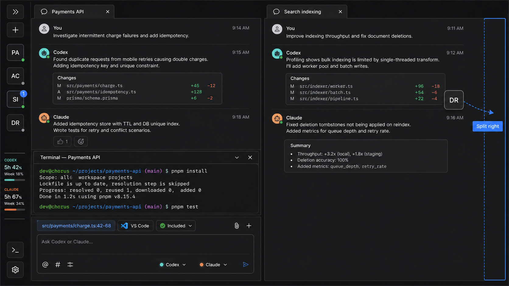
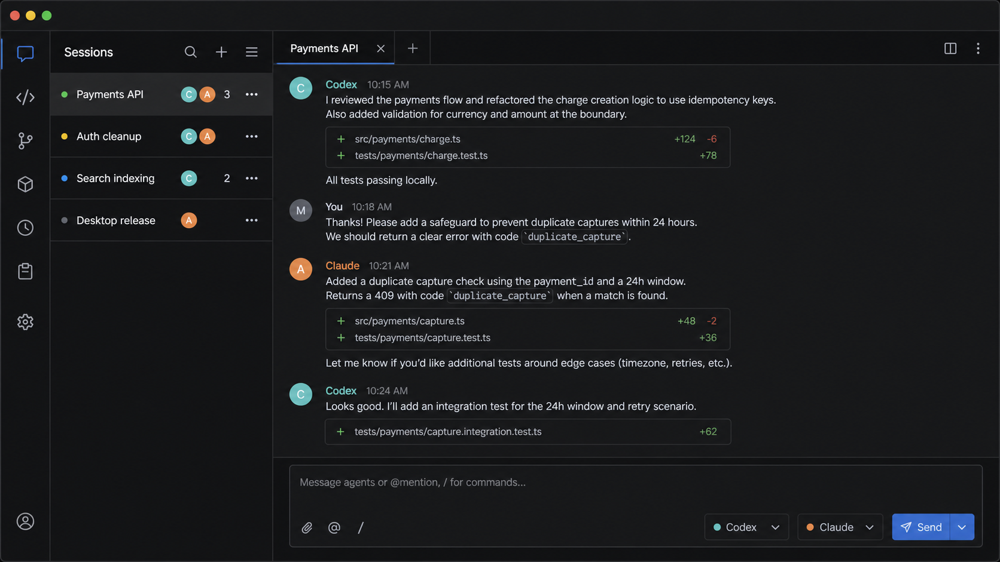
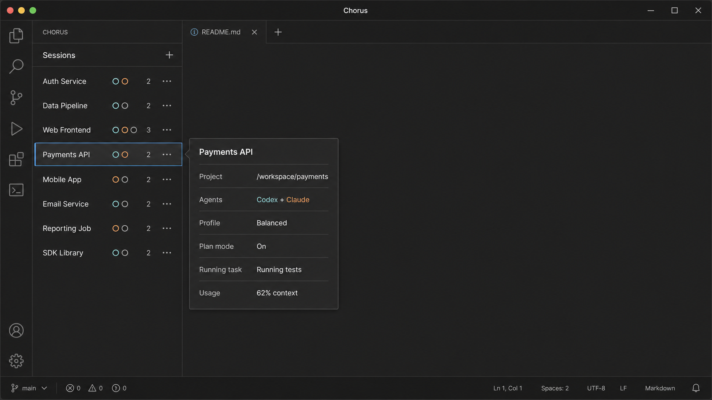
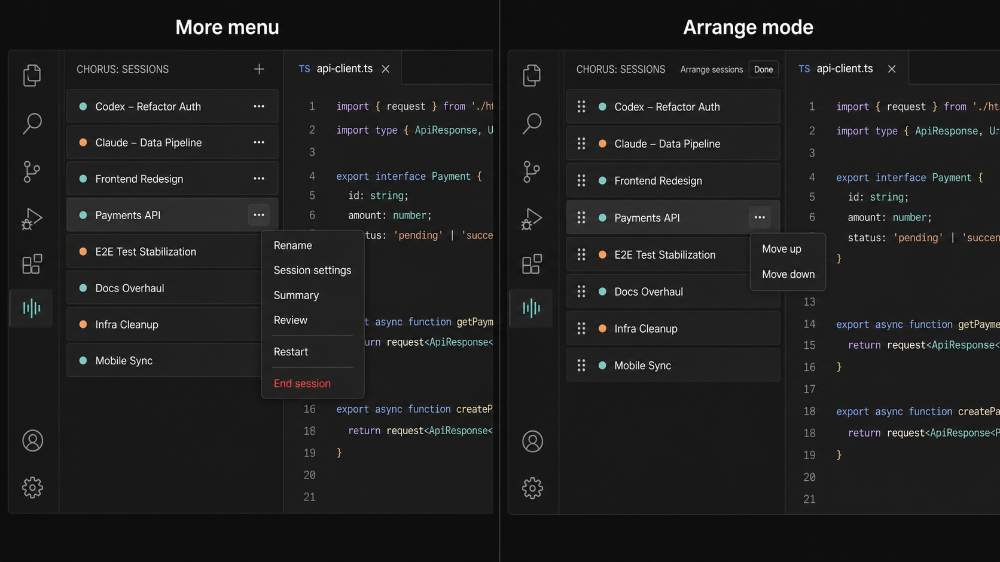

# A readable control rail

**State:** implementation behaviour passed, but visual approval was rejected — pixel-parity correction in progress  
**Date:** 2026-08-13  
**Scope:** the collapsed quick rail, expanded session drawer, workspace session placement, composer IDE context, theme tokens, and renderer responsiveness  
**Evidence:** source, styles, e2e coverage, performance measurements, and three 1440×900 screenshots of the built Electron UI were independently reviewed. The user rejected those screenshots because their visual composition does not match the approved reference; the supplied 2718×1536 reference is now the primary visual acceptance source.

**Latest visual override:** retain a compact top header containing the Chorus wordmark and real app version. The approved reference controls the workspace below that header.

## The problem

The left side is doing too many jobs in too little space. A session card currently contains the session title and state, agent toggles, profile selection, folder editing and clearing, Plan mode, running tasks, Summary, Review, cost, context usage, Restart, and End. The whole surface is also a drag handle. One object therefore behaves as navigation, configuration, monitoring, destructive action, and reordering at the same time.

That density is visible in [`Workspace.tsx`](../../../apps/desktop/src/renderer/src/workspace/Workspace.tsx): `SidebarSession` spans roughly lines 1135–1715, while `useRowReorder` makes every pixel of the card draggable after a 5px movement. The matching e2e spec deliberately asserts that all of those controls are present in every row. The complexity is not incidental styling; it is the current information architecture.

The colour problem is measurable. The current `--faint` foreground is used throughout the chrome, including session paths, Summary/Review, spend, context, inactive icons, and secondary labels. Its contrast is below WCAG AA for normal text on every main surface:

| Theme           | On ground | On raised | On sunken | WCAG AA normal text |
| --------------- | --------: | --------: | --------: | ------------------: |
| Dark `#5d5775`  |    2.69:1 |    2.50:1 |    2.81:1 |               4.5:1 |
| Light `#8b85a0` |    3.04:1 |    3.52:1 |    2.76:1 |               4.5:1 |

[`styles.css`](../../../apps/desktop/src/renderer/src/styles.css) uses `var(--faint)` more than sixty times, so changing one hex without classifying the use would make some text better while leaving translucent mixes and icons unreadable. This needs semantic tokens and explicit contrast pairs.

The reported lag also has concrete risk paths, but it is not yet honest to call any one of them the cause:

- `Workspace` subscribes to `useAllPulses()`, so every event changes the pulse object and re-renders the shell while an agent streams.
- Each `SidebarSession` subscribes to the entire pulse, including `lastSeq`, so the affected card re-renders even when none of its visible state changed.
- `Entry` is memoised, but inline callbacks can still invalidate memoisation; React explicitly warns that a newly created function is enough to defeat `memo`.
- `useTypewriter` intentionally keeps a 140ms presentation backlog. Its own comment calls that tail perceptible as the app being behind the agent.
- The existing workspace measurement found four mounted streaming sessions at 35.6–36.7% renderer CPU, with 10.8–12% in layout. Background, unmounted sessions were almost free. This makes render isolation more valuable than broad throttling.

These are hypotheses to profile in the real app. Previous work already proved that renderer-side delta coalescing makes markdown streaming worse, so this plan does not reintroduce it.

## What comparable products and standards say

[Cursor's Background Agents](https://docs.cursor.com/background-agent) uses a native sidebar as a searchable list of agents; selecting one opens its status and machine. That is a list/detail relationship, not a stack of permanent control panels.

[VS Code's workbench model](https://code.visualstudio.com/api/ux-guidelines/overview) separates the Activity Bar, Primary Sidebar, editor, and panel by responsibility. Its [View guidance](https://code.visualstudio.com/api/ux-guidelines/views) recommends tree/list views, no more than three actions on an item, and care with toolbar action noise. Its [Sidebar guidance](https://code.visualstudio.com/api/ux-guidelines/sidebars) explicitly warns that excessive sidebar UI causes clutter and confusion and recommends an overflow menu when actions accumulate.

[Apple's sidebar guidance](https://developer.apple.com/design/human-interface-guidelines/sidebars) recommends a broad, flat hierarchy, disclosure for large amounts of content, user control over order, familiar symbols, a hide/show affordance, and automatic collapse when window width is constrained. That fits Chorus's macOS shell better than permanently expanded mini forms.

[VS Code Dark Modern](https://raw.githubusercontent.com/microsoft/vscode/main/extensions/theme-defaults/themes/dark_modern.json) uses a graphite hierarchy: `#181818` chrome, `#1f1f1f` editor, `#2b2b2b` borders, `#cccccc` foreground, and `#9d9d9d` descriptions. The important lesson is not to copy those five values blindly; it is the clear foreground hierarchy and the separation of background, surface, control, border, and state tokens. [GitHub Primer](https://primer.style/product/getting-started/foundations/color-usage/) makes the same architectural point: components consume functional tokens, not raw palette colours.

[WCAG 2.2](https://www.w3.org/TR/WCAG22/) supplies the non-negotiable constraints: 4.5:1 contrast for normal text, at least 24×24 CSS-pixel pointer targets, a non-drag alternative for drag operations, and hover/focus content that is dismissible, hoverable, and persistent. A hover card can therefore be part of the answer, but it cannot be the only way to find or operate essential controls.

## The target shape

The collapsed state is the primary working state because that is how the product will be used most of the day. The existing activity bar and hidden sidebar edge become one useful quick rail rather than two concepts competing for the same left edge.

```text
┌────────┬─────────────────────────────────────────────────────────────────┐
│ quick  │ editor / conversation                                           │
│ 60 px  │                                                                 │
│ [≡]    │ the active session keeps almost the whole window                │
│ [+]    │                                                                 │
│ [PA] • │                                                                 │
│ [AC] ◐ │                                                                 │
│ [SI] 2 │                                                                 │
│ [DR] ○ │                                                                 │
│   ⋮    │                                                                 │
│ [>_]   │                                                                 │
│ C 5h42 │                                                                 │
│ C Wk18 │                                                                 │
│ A 5h67 │                                                                 │
│ A Wk34 │                                                                 │
│ [⚙]    │                                                                 │
└────────┴─────────────────────────────────────────────────────────────────┘
```

Opening the session drawer is a temporary management state:

```text
┌────────┬──────────────────────────┬─────────────────────────────────────┐
│ quick  │ sessions drawer          │ editor / conversation               │
│ 60 px  │ 248 px default           │                                     │
│        │ [ Search…          ••• ] │                                     │
│        │ ● Fix login      2   ••• │                                     │
│        │ ◐ Refactor API       ••• │                                     │
│        │ ! Release prep   1   ••• │                                     │
│        │ ○ Docs cleanup       ••• │                                     │
└────────┴──────────────────────────┴─────────────────────────────────────┘
```

### The collapsed quick rail

The 60px rail keeps the daily loop available without reopening the drawer:

- fixed top: show/hide the session drawer and create a new session;
- scrollable middle: one 44×44 shortcut for every session, in the persisted user order;
- fixed bottom: global terminal, both account-usage windows for both agents, and settings.

A session shortcut uses a stable two-letter title monogram, a state mark, and an unread/waiting count only when nonzero. Agent participants stay in the preview instead of competing with state at this width. The active shortcut has a shape/edge treatment in addition to colour. Clicking opens or focuses that session; hover or keyboard focus opens the same read-only preview used by a full row. There is no `More` action, drag handle, or destructive control in the quick rail.

The shortcut list scrolls independently between the fixed groups, so every session remains reachable without pushing terminal or account state out of view. It does not reorder automatically when a session becomes active; stable positions preserve muscle memory. Keyboard navigation uses one roving tab stop with arrow keys and Enter rather than making a user tab through twenty shortcuts.

Account usage is not compressed into a single worst-case percentage. The rail keeps four stable readings: Codex 5-hour, Codex weekly, Claude 5-hour, and Claude weekly, using the provider labels returned by the existing limits channel. Each reading shows the window label and percentage; hover or keyboard focus opens the existing detailed popover with the full reset countdown. This is monitoring information, so it remains readable without becoming four extra buttons.

### The session row

The expanded drawer's row is 44px high and has one primary target: open or focus the session. It shows only the facts needed to scan the list:

- a state mark with shape and text alternative: idle, working, waiting, or failed;
- the title, at 13px medium weight in the UI font;
- the participant marks;
- one unread/waiting count when nonzero;
- one `More` button, always keyboard reachable and visible on the active row, hover, and focus.

No path editor, profile picker, agent toggles, restart, end, output buttons, or task list is mounted in every row. Search, history, and Arrange belong to the drawer toolbar because they act on the list as a whole. New session stays in the quick rail because it is part of the daily loop.

### The hover/focus preview

Hovering for 180–220ms or focusing a quick-rail shortcut or drawer row shows one singleton preview, portalled to the body so it cannot be clipped by the rail or drawer. It is informational and read-only: full title, project path, participants, profile, Plan state, running task summary, tokens/cost, and context usage. It never expands the trigger or moves either list.

The preview is also shown from keyboard focus, accepts pointer hover without closing, closes with Escape, and remains until both trigger and preview lose hover/focus. A 120ms close grace prevents the gap between row and preview from making it flicker. Reduced-motion users get no transition; everyone else gets opacity plus at most 4px of translation, never animated width or height.

Actions do not live only in this preview. The `More` menu remains the durable route for mouse, keyboard, and assistive technology.

### The composer keeps IDE path context

Collapsing the drawer must not hide what VS Code selection will be sent with a message. The existing composer IDE pill remains attached to every pane's input and continues to show the relative file path, selected line range, provenance such as VS Code, and Included/Excluded state. The session project directory belongs in the preview and settings; the live editor selection belongs beside the message that will consume it.

### A terminal can belong to one session

The composite review state uses the existing session terminal, not the global terminal. It sits only inside the owning pane, between that session's transcript and composer, and stops at the pane divider. Its height remains independently resizable. Other split panes keep their full height and do not inherit, mirror, or make room for it. The rail terminal action still opens the separate global terminal when that workspace-wide shell is wanted.

### Where the current actions go

| Current card content                            | New home                                                                                        | Reason                                               |
| ----------------------------------------------- | ----------------------------------------------------------------------------------------------- | ---------------------------------------------------- |
| Open/focus                                      | Quick-rail shortcut or whole drawer row                                                         | The primary list action survives collapse            |
| Working, waiting, unread                        | Quick-rail shortcut and drawer row                                                              | Must be visible at a glance                          |
| Project, participants, profile, Plan state      | Hover/focus preview                                                                             | Useful context, not a permanent form                 |
| VS Code selected path and lines                 | Composer IDE context pill                                                                       | Message input must show the context it will send     |
| Tokens, cost, context, tasks                    | Preview; task count may also mark the row                                                       | Monitoring, shown on demand                          |
| Change folder, participants, profile, Plan mode | `More → Session settings`                                                                       | Configuration needs a stable surface                 |
| Summary, Review                                 | `More` and the active session's toolbar/menu                                                    | They already activate the session before opening     |
| Restart, End                                    | Bottom of `More`, separated by a divider; End remains danger-coloured and confirms when working | Destructive actions should not sit beside navigation |
| Rename                                          | `More → Rename` and existing double-click shortcut                                              | Keeps the row simple without removing the fast path  |
| Reorder                                         | Explicit Arrange mode, with a visible grip plus Move Up/Down menu actions                       | The whole row stops being an accidental drag target  |

Arrange mode is opt-in and temporary. Outside it, pointer movement over a row can never reorder sessions. Inside it, rows expose a dedicated grip and keep Move Up/Down actions so dragging is not required.

### Reorder versus drag into the workspace

The same session shortcut supports two deliberately different destinations:

- in normal mode, dragging from the quick rail or drawer into the workspace places the session as a tab or pane;
- in Arrange mode, dragging within the rail or drawer changes the persisted session order.

A normal click still opens the session. Once pointer movement crosses the drag threshold, the workspace shows the existing target language: tab-strip insertion, centre drop to place or move into a pane, and edge drop to split left, right, up, or down. A session that is already open moves rather than duplicates; a closed session opens at the destination. The four-pane maximum and disabled-target feedback remain intact.

Dropping back into the rail does not silently reorder in normal mode. Reordering requires the explicit Arrange state, where the shortcut itself becomes the handle and insertion guides appear. `Move Up` and `Move Down`, plus `Open in pane` and `Split …` menu commands, provide non-drag alternatives.

### Typography

Chrome moves to the macOS system UI stack: `-apple-system, BlinkMacSystemFont, "SF Pro Text", sans-serif`. Monospace remains for code, terminal output, file paths, token counts, and key chords. A permanent all-monospace interface makes labels, prose, and code compete in the same voice; the new split lets code still look like code.

Minimum sizes:

- 13px / 1.4 for titles and normal chrome;
- 12px / 1.4 for secondary metadata;
- 11px only for short badges or counts, never for a sentence or path;
- 28px minimum control box inside the 44px row, exceeding WCAG's 24px floor.

### Proposed semantic palette

The palette uses the neutral hierarchy proven in editor applications while retaining Chorus's Codex and Claude hues as identity/status accents. Every listed text colour is at least 4.5:1 on its documented surfaces.

| Token              | Dark      | Light     | Use                                   |
| ------------------ | --------- | --------- | ------------------------------------- |
| `--bg-canvas`      | `#1f1f1f` | `#ffffff` | transcript/editor                     |
| `--bg-chrome`      | `#181818` | `#f6f8fa` | quick rail/drawer/tab strip           |
| `--bg-surface`     | `#252526` | `#f0f2f5` | preview, menu, selected row           |
| `--bg-control`     | `#313131` | `#eaeef2` | input and pressed control             |
| `--border-default` | `#3c3c3c` | `#d0d7de` | separators and control edges          |
| `--text-primary`   | `#e6e6e6` | `#1f2328` | messages, row titles, active controls |
| `--text-secondary` | `#b3b3b3` | `#424a53` | ordinary chrome and metadata          |
| `--text-muted`     | `#9d9d9d` | `#59636e` | tertiary but still readable text      |
| `--accent-text`    | `#4daafc` | `#0969da` | links and selected text accents       |
| `--focus-ring`     | `#58a6ff` | `#0969da` | focus only; not a text colour         |
| `--voice-codex`    | `#7fd1c1` | `#0e7469` | Codex identity/status                 |
| `--voice-claude`   | `#e9a05c` | `#9a520f` | Claude identity/status                |
| `--danger`         | `#f85149` | `#cf222e` | failures and End                      |

`--text-disabled` may be lower contrast only on genuinely disabled controls. There is no general-purpose `--faint` text token. Borders, placeholder text, disabled text, and decorative marks get separate tokens so translucency cannot silently turn readable copy into decoration.

## Phase 0 — establish the visual and performance baseline

Record the current interface at dark and light system themes, at 240px, 336px, and a narrow window, with one, six, and twenty sessions. Capture the current collapsed and expanded states plus idle, working, waiting, unread, long-title, long-path, multiple-task, and near-full-context sessions. The screenshots are evidence for the redesign, not golden pixel snapshots.

Add a deterministic performance scenario around the existing Electron harness. Measure rail, drawer, and transcript React commits with the React Profiler in a profiling build, plus renderer task/layout time through the existing CDP measurement path. The workload must cover one and four mounted sessions, one and six streams, a 25k-character markdown reply, quick-rail switching and scrolling, session search, preview open/close, normal drag-to-split, Arrange-mode reorder, split panes, and an open terminal.

Budgets:

- p95 React commit under 8ms on the 120Hz reference machine;
- under 1% dropped frames during realistic streaming;
- ordinary click or key interaction painted within 100ms, with 200ms as the hard failure ceiling;
- preview paint under 100ms after its intentional dwell delay;
- no increase in the established background-stream cost.

The 200ms ceiling matches the published good-response threshold for [Interaction to Next Paint](https://web.dev/articles/inp); the tighter 100ms product target is appropriate for a local desktop app. The profiler is diagnostic only and does not ship enabled.

**Likely files:** [`apps/desktop/e2e/harness.mjs`](../../../apps/desktop/e2e/harness.mjs), [`apps/desktop/e2e/specs.mjs`](../../../apps/desktop/e2e/specs.mjs), and a focused perf script or research note under `docs/research/`.

**Exit:** before measurements, screenshots, and exact reproduction steps are written down; no optimisation claim exists without a number.

## Phase 1 — replace raw colour hierarchy with readable semantic tokens

Introduce the palette and UI font at the top of `styles.css`, then migrate by role rather than globally replacing `--faint`. Start with the quick rail, drawer, tabs, menus, inputs, composer chrome, and transcript metadata. Keep syntax and terminal palettes separate.

Add a small contrast test that reads the actual theme tokens and checks the documented foreground/background pairs. It must cover both system themes and fail if a readable text token drops below 4.5:1 or a meaningful control boundary/focus mark drops below 3:1. Disabled-only and decorative pairs must be named exceptions rather than falling through a generic token.

**Likely files:** [`styles.css`](../../../apps/desktop/src/renderer/src/styles.css), a new `theme.test.ts`, and only the components whose class roles need to be made explicit.

**Exit:** no user-readable sidebar or workspace copy resolves to the old `--faint`; contrast tests pass in both themes; code, prose, chrome, and disabled states remain visibly distinct.

## Phase 2 — replace the card stack with the compact session rail

Split the 1,900-line workspace component so the list can evolve without entangling pane splitting and tab drag:

- `QuickRail.tsx` — the persistent collapsed state, daily actions, four account-window readings, and session shortcuts, replacing the current `ActivityBar`;
- `SessionList.tsx` — expanded drawer, search, list toolbar, selection, and preview ownership;
- `SessionRow.tsx` — the 44px scan row;
- `SessionPreview.tsx` — the singleton hover/focus card and placement;
- `SessionMenu.tsx` — rename, settings, outputs, restart, and end;
- `session-row.ts` — pure projection from `SessionInfo + SessionPulse` to visible row/preview facts.

Keep `Workspace.tsx` responsible for shell layout, panes, sashes, tabs, and global terminal. Do not add a component library for four primitives that the repo already implements safely with portals and typed state.

The quick rail remains 60px and the drawer is resizable, with a 248px default and a 220–320px useful range. The rail owns all collapsed behaviour; remove the invisible sidebar-edge hover target and do not create a second thin strip. Under the narrow breakpoint the drawer becomes an overlay or closes after selection instead of covering the editor permanently.

All new user-facing copy goes through [`i18n/en.json`](../../../apps/desktop/src/renderer/src/i18n/en.json).

**Likely files:** [`ActivityBar.tsx`](../../../apps/desktop/src/renderer/src/workspace/ActivityBar.tsx), [`Workspace.tsx`](../../../apps/desktop/src/renderer/src/workspace/Workspace.tsx), new workspace components/helpers, [`styles.css`](../../../apps/desktop/src/renderer/src/styles.css), [`i18n/en.json`](../../../apps/desktop/src/renderer/src/i18n/en.json), and the sidebar portion of [`e2e/specs.mjs`](../../../apps/desktop/e2e/specs.mjs).

**Exit:** with the drawer closed, every session remains reachable in stable order and new session, terminal, four labelled account-window readings, and settings remain available; twenty shortcuts scroll without moving the fixed groups; a drawer row has one primary action and one overflow action; preview works from either representation by hover and keyboard; every composer keeps its VS Code context pill; opening the preview causes no list reflow.

## Phase 3 — make actions and reordering intentional

Move configuration and destructive controls out of every row. The session menu must be a stable, portalled surface with labelled actions and a separated danger section. Session settings may reuse existing profile, folder, participant, and Plan controls, but it mounts only for the selected session.

Replace whole-row reorder drag with Arrange mode. The pure reorder function and persisted order remain unchanged; only the gesture changes. Add Move Up and Move Down alternatives and announce the result to assistive technology. Escape exits Arrange mode without committing an in-progress drag.

Extend the existing pointer-based tab drag system so quick-rail and drawer sessions can use the same measured pane targets and `DragFeedback`. Refactor the drag source to distinguish an existing tab from a rail/drawer session. Add a pure layout operation for placing a session that is not already open; existing sessions continue through move/split semantics so the invariant that one live session appears only once is preserved.

The hover preview remains read-only. This is deliberate: an interactive card that disappears because the pointer crossed a gap is a bad home for Plan, Stop task, or End. If later evidence shows direct preview actions are valuable, the preview can gain an explicit pin state; they do not enter this phase by accident.

**Likely files:** the new rail/list/menu components, [`Workspace.tsx`](../../../apps/desktop/src/renderer/src/workspace/Workspace.tsx), [`useTabDrag.ts`](../../../apps/desktop/src/renderer/src/workspace/useTabDrag.ts), [`layout.ts`](../../../apps/desktop/src/renderer/src/workspace/layout.ts), [`layout.test.ts`](../../../apps/desktop/src/renderer/src/workspace/layout.test.ts), [`i18n/en.json`](../../../apps/desktop/src/renderer/src/i18n/en.json), and [`e2e/specs.mjs`](../../../apps/desktop/e2e/specs.mjs).

**Exit:** normal rail/drawer drags can insert, move, or split a session but never reorder the list; Arrange exposes obvious reorder feedback; every placement and reorder is also possible without dragging; a closed session can be dropped into a pane without creating duplicates; invalid fifth-pane drops are visibly disabled; End cannot be triggered by an accidental row click.

## Phase 4 — isolate streaming updates and remove artificial response lag

Profile first, then make the narrowest fixes that the measurements justify.

The high-confidence subscription cleanup is:

- replace `useAllPulses()` in `Workspace` with a primitive `useWorkingSessionCount()` selector so a delta that does not change the count cannot re-render the shell;
- replace `useSessionPulse()` in each row with a shallow `useSessionRowState()` projection that omits `lastSeq` and any other invisible field;
- drive each quick-rail shortcut from the same narrow projection so hidden metadata and text deltas cannot repaint the rail;
- mount one preview and one menu for the list, not one hidden copy per session;
- keep transient hover, menu, and Arrange state local to the list rather than the workspace store.

Then inspect the transcript trace. If completed entries re-render because of unstable callback props, stabilise the handoff callback or move it behind an id-based handler. Do not add blanket `memo` calls without a profiler trace, and do not reintroduce renderer-side delta coalescing.

Change the typewriter contract so `agent.message.completed` flushes the full authoritative text immediately. Streaming may keep a short smoothing window, but completion cannot leave a visible tail that says the app is still catching up after the agent has finished. Compare immediate chunks, a 60–80ms maximum backlog, and the current 140ms value under the same trace; keep the smallest motion that still reads cleanly.

Finally, inspect the known resize-settle path. If the new sidebar or preview triggers repeated layout/observer cycles, fix it before calling the rail smooth. No transition may animate a dimension that drives transcript layout.

**Likely files:** [`hooks.ts`](../../../apps/desktop/src/renderer/src/workspace/hooks.ts), [`store.ts`](../../../apps/desktop/src/renderer/src/workspace/store.ts), new row projection tests, [`Session.tsx`](../../../apps/desktop/src/renderer/src/Session.tsx), [`Entry.tsx`](../../../apps/desktop/src/renderer/src/Entry.tsx), [`useTypewriter.ts`](../../../apps/desktop/src/renderer/src/useTypewriter.ts), and [`typewriter.test.ts`](../../../apps/desktop/src/renderer/src/typewriter.test.ts).

**Exit:** row and shell render counts stay flat during an ordinary text delta; completion has no visible typewriter tail; all Phase 0 workloads meet or improve the budgets; before/after CPU, layout, commit, and interaction numbers are recorded.

## Phase 5 — accessibility, regression, and visual approval

Update the existing sidebar e2e scenario instead of keeping assertions for the old dense cards. Cover:

- collapsed quick rail as the default daily state, including independent overflow scrolling and fixed top/bottom controls;
- Codex 5-hour, Codex weekly, Claude 5-hour, and Claude weekly readings plus their reset-detail popover;
- quick-rail session switching, roving keyboard focus, duplicate monograms, state, unread, and active treatments;
- normal rail/drawer drag to tab strip, pane centre, and all four split edges, including a closed session and an already-open session;
- Arrange-mode rail/drawer reorder and the non-drag Move Up/Down alternatives;
- split panes with the global and per-session terminal paths, while each composer preserves its VS Code path, lines, provenance, and inclusion state;
- mouse, keyboard, and screen-reader names for list navigation;
- preview open by hover and focus, pointer travel into it, Escape dismissal, and persistence;
- search without reorder corruption;
- active, open elsewhere, offscreen, working, waiting, unread, failed, and idle states;
- menu focus return and destructive confirmation;
- 200% zoom and narrow-window reflow;
- light, dark, and reduced-motion modes;
- no clipped portal near the right, top, or bottom window edges.

Run targeted renderer tests while iterating, then `pnpm check`. Run the relevant Electron specs before the full e2e suite. Because the project's e2e suite is known to be flaky, report both the targeted result and the full-suite result rather than converting an unrelated intermittent failure into a false UI verdict.

The final gate is a human visual pass over the Phase 0 state matrix. The redesign is complete only when the user approves the hierarchy and can identify active, working, waiting, and unread sessions without comparing neighbouring rows.

**And a green suite. `specs.mjs` in full, nothing failing.** This is an exit criterion rather than a nicety because the suite is currently red _at this plan's own surfaces_ — see STATUS § "10. What the suite says, and the three-run matrix behind it". Seven of the eight failures are this redesign's, and one of them is a real gap rather than a stale assertion. A visual approval taken while those sit red would approve a picture of something the specs say is broken, which is the same mistake §8 already records once.

Note the interaction with C-029: a flaky suite cannot be an exit criterion on a single run. The bar is that no failure is _this plan's_ — attributable intermittents may be re-run and named, per the reporting rule in the paragraph above.

## What this deliberately does not do

- It does not redesign the transcript, composer, approval cards, terminal, settings, or history panel except where shared tokens and performance isolation touch them.
- It does not put essential actions behind hover.
- It does not replace the existing tab and pane drag system or introduce a freeform canvas; it extends the current target resolver to rail/drawer drag sources.
- It does not add virtualisation before a trace shows list or transcript DOM size is a bottleneck.
- It does not add renderer-side stream coalescing; the repo already measured that as worse for markdown.
- It does not add a new UI framework or icon package.
- It does not use colour alone for state, or make every accent compete at once.

## Visual review appendix

These are generated concept mockups for hierarchy and interaction review, not screenshots of the current implementation or exact pixel specifications. Familiar editor iconography is used only to make the layout legible; production keeps Chorus's own navigation, content, and component language.

Screenshots of what was actually built are the `visuals/impl-*.png` files, captured from the built app by `apps/desktop/e2e/shots-rail.mjs` and listed in STATUS. Compare them against these mockups rather than mistaking one for the other.

### 1. Primary workspace: usage, split views, session terminal, IDE path, and drag target

This is the complete daily state: the rail shows Codex and Claude 5-hour/weekly usage separately; two sessions share a split workspace; only Payments API has its terminal open between its transcript and composer; the composer keeps the selected VS Code path; and a rail session is being dragged to a right-edge split target. This is not the global terminal.



### 2. Expanded session drawer

The drawer opens for searching and managing sessions. A session is one scannable row with state, title, participants, count, and one durable `More` target; the permanent configuration controls and nested cards are gone.



### 3. Read-only hover and focus preview

The singleton preview reveals full context without expanding the row or reflowing the list. It is deliberately informational; actions remain in a stable menu.



### 4. Intentional actions and reordering

Ordinary rows open the session and expose one `More` menu. Reordering becomes a temporary mode with dedicated grips and non-drag alternatives, so pointer movement cannot accidentally rearrange sessions.



## Needs a decision before implementation

1. **Preview behaviour — recommended:** read-only hover/focus preview, with all actions in `More`. Alternative: click pins the preview and turns it into an interactive detail popover. The recommended version is simpler, safer, and more minimal.
2. **Drawer width — recommended:** 248px default, resizable 220–320px. Alternative: fixed 240px. Keeping a bounded resize respects the existing preference without allowing the temporary drawer to dominate the window.
3. **Collapsed quick rail — updated from visual feedback:** make 60px the primary state and show every session in a stable, independently scrollable middle group. A recent-only or auto-reordering rail is rejected because shortcuts would move under the pointer and older sessions would disappear from daily reach.
4. **Drag semantics — updated from visual feedback:** normal rail/drawer drag places or splits a session in the workspace; Arrange-mode drag reorders the session list. Keeping these destinations mode-specific prevents a workspace drop from unexpectedly changing list order.
5. **Plan mode location — recommended:** keep it in `More → Session settings` for background sessions and expose its current state in the preview. If Plan is used several times per hour, promote it later to the active session's composer chrome based on evidence.

## Open risks

- The hover preview could feel noisy if it opens while the user is merely crossing the list. The dwell delay, singleton ownership, and no reflow are the safeguards; Phase 0/5 must validate them with a dense list.
- Two-letter shortcuts can collide. Full accessible names and the preview remove ambiguity, while a deterministic fallback suffix distinguishes duplicate visible monograms without relying on colour.
- Normal drag and Arrange drag share a visual source but not a destination. The rail must show the current mode and the workspace must show explicit drop labels; otherwise the gesture becomes as ambiguous as the current whole-card reorder.
- Moving controls may initially feel like an extra click to expert users. Preserve existing shortcuts and double-click rename, then add command-palette entries only for repeated actions proven to need them.
- Theme migration is broad because `--faint` is broad. Land semantic tokens and the sidebar first; migrate unrelated screens only when their current token becomes misleading, so the feature does not become an unbounded visual rewrite.
- Performance work can easily optimise a synthetic workload and miss the complaint. Record the exact lag interaction from the running app before changing the render path, and keep the before/after trace with the plan status when it ships.

> **Golden line:** the quick rail runs the daily loop, the workspace accepts intentional session drops, and the drawer appears only for names, search, or management.
